# Note: This README was AI-assisted and is the only part of this project where I used AI to summarize my work.

# sync

Technical interview project: a .NET console application that keeps two folders synchronized and provides an interactive menu to configure behavior at runtime.

This README explains what I built, how I designed it, why I made specific tradeoffs, and how the pieces fit together.

## What I Built

I implemented a file synchronization CLI with these core capabilities:

- Runtime configuration through an interactive Spectre.Console menu
- Continuous polling-based synchronization from source folder to target folder
- Change detection using file hashes
- Support for write, update, and delete propagation into the target folder
- JSON log persistence for every operation
- Automated tests for key interaction flow

## Problem Framing and Approach

The goal was to build a practical sync tool with clear architecture, not just a single script.

I split responsibilities into independent layers:

- Application orchestration
- Option handling (interactive commands)
- Sync engine (file replication logic)
- Logging pipeline (async queue and persistence)
- Configuration state (shared runtime settings)

This allowed me to keep each concern small and testable while still shipping an end-to-end workflow.

## Architecture Overview

High-level execution flow:

1. App starts in Program and builds a DI container.
2. Application launches two concurrent loops:
	- menu loop for user options
	- sync loop for file replication
3. Both loops share one cancellation token so the app can shut down cleanly.

Main files:

- src/Program.cs
- src/Application.cs
- src/Bootstrap.cs

## Design Patterns Used

### 1. Command-style option pattern

Each menu action is implemented as its own class inheriting OptionBase:

- SetSourceFolderOption
- SetTargetFolderOption
- SetIntervalOption
- SetLogPathOption
- LoadConfigOption
- ReadLogsOption

Why this pattern:

- Keeps each command isolated and easy to reason about
- Makes adding a new option straightforward
- Avoids a large switch block with mixed logic

Related files:

- src/Options/OptionBase.cs
- src/Options/Options.cs
- src/Options/SetSourceFolderOption.cs
- src/Options/SetTargetFolderOption.cs
- src/Options/SetIntervalOption.cs
- src/Options/SetLogPathOption.cs
- src/Options/LoadConfigOption.cs
- src/Options/ReadLogsOption.cs
- src/Options/Enums/OptionsEnum.cs

### 2. Dependency Injection with reflective registration

In Bootstrap, all non-abstract subclasses of OptionBase are discovered via reflection and registered as singletons.

Why this pattern:

- Reduces repetitive DI setup when options grow
- Centralizes service registration
- Improves maintainability for future extension

Related file:

- src/Bootstrap.cs

### 3. Producer/consumer logging queue

FileLogger uses a Channel to queue log entries and a dedicated background consumer task to write JSON.

Why this pattern:

- Keeps sync operations lightweight by decoupling write latency
- Supports multiple writers with a single reader
- Prevents contention around direct file writes inside sync loop

Related file:

- src/Logger/FileLogger.cs

### 4. Polling sync loop with helper methods

FolderSync separates responsibilities into focused methods:

- SyncDeletedFiles
- SyncSourceFiles
- UpdateIfChanged
- WriteFile
- DeleteFile

Why this pattern:

- Cleaner than one long loop
- Easier to test and modify each behavior
- Improves readability in interview/code review discussions

Related file:

- src/FolderManagement/FolderSync.cs

## Synchronization Logic (Current Behavior)

Every cycle:

1. Compare source and target names to identify target files missing in source and delete them.
2. Iterate source files.
3. If target file exists, compare MD5 hashes.
4. Copy if changed and log UPDATE.
5. Copy new file and log WRITE.
6. Wait configured interval and repeat.

Hash comparison is implemented in:

- src/Helpers/Hash.cs

Operation enum:

- src/FolderManagement/FileOperation.cs

## Runtime Configuration Model

Config stores mutable runtime settings:

- SourceFolder
- TargetFolder
- LogFilePath
- TimeIntervalInSeconds

Default values:

- source: ./data/source
- target: ./data/replica
- log path: ./logs/logs.json
- interval: 1 second

The source and target option handlers also create directories immediately after updates.

Related file:

- src/Config.cs

## Logging Format

Logs are persisted as JSON dictionary entries keyed by UTC timestamp in round-trip format.

Each entry includes:

- FileName
- Operation

Related files:

- src/Logger/Log.cs
- src/Logger/LogFile.cs
- src/Logger/FileLogger.cs

## Technologies Used

- C# / .NET 10 (`net10.0`)
- Microsoft Dependency Injection (`Microsoft.Extensions.DependencyInjection`)
- Spectre.Console (interactive CLI prompts and output)
- System.Threading.Channels (asynchronous producer/consumer logging queue)
- System.Text.Json (JSON serialization for log persistence)
- MD5 hashing via `System.Security.Cryptography` (file change detection)
- xUnit (test framework)
- Spectre.Console.Testing (console interaction testing)
- Coverlet Collector (test coverage tooling)
- Make (simple run/test command orchestration)

## How to Run

Prerequisites:

- .NET SDK 10
- make

Commands:

```bash
make run
make test
```

## Run With Docker

Prerequisites:

- Docker Desktop (or another Docker daemon) running

Build image:

```bash
docker build -t sync-app .
```

Run container (interactive, with data and logs persisted to host):

```bash
docker run --rm -it -v "$(pwd)/data:/app/data" -v "$(pwd)/logs:/app/logs" sync-app
```

Equivalent Makefile targets:

```bash
make docker-build
make docker-run
```

### make run Screenshots

Startup command:

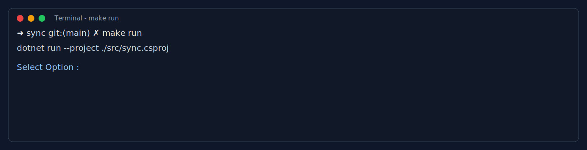

Interactive options menu:

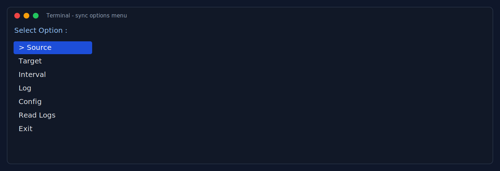

Running state (waiting for user selection):

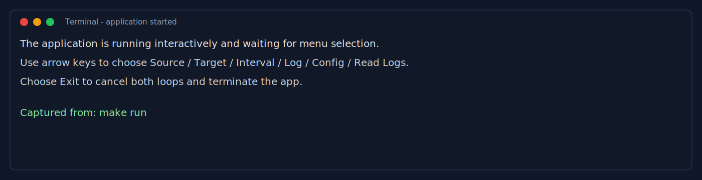

### All Scenarios Screenshots

Source option:


Target option:

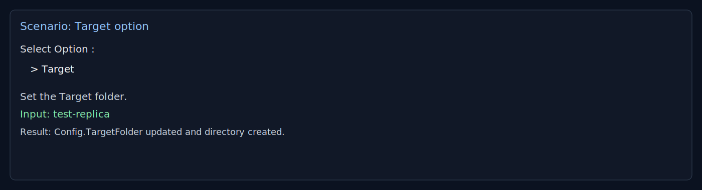

Interval option:

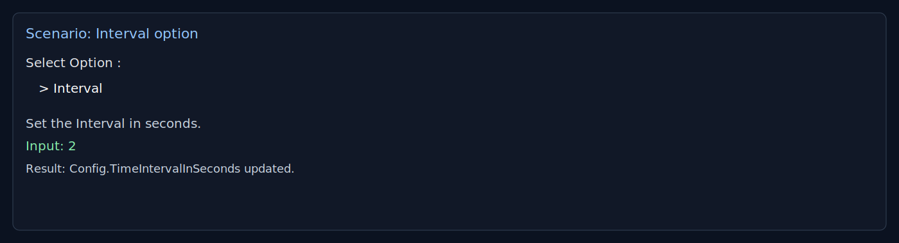

Log option:

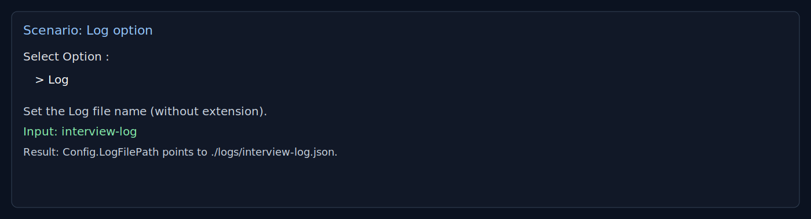

Config option:

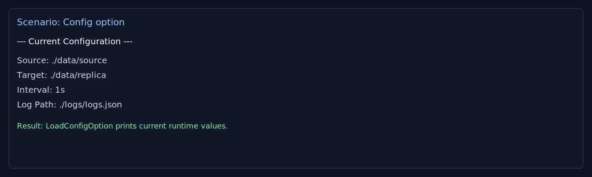

Read Logs option:

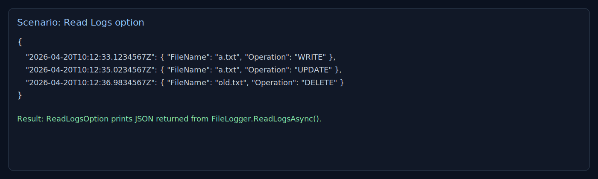

Exit option:

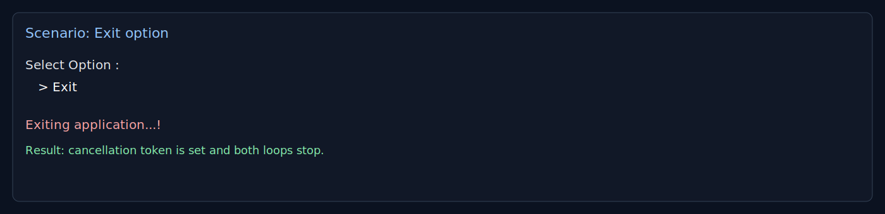

Sync WRITE scenario:

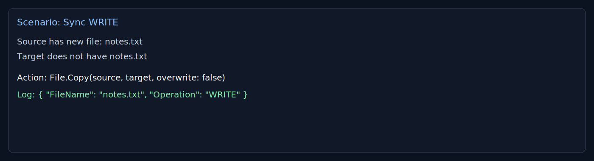

Sync UPDATE scenario:

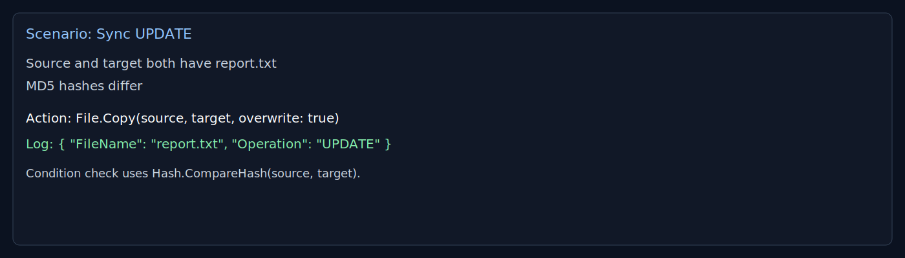

Sync DELETE scenario:

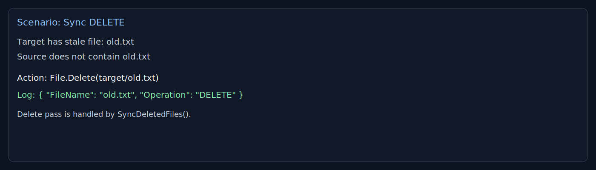

Makefile target mapping:

- run -> dotnet run --project ./src/sync.csproj
- test -> dotnet test ./Tests/Tests.csproj

Related file:

- Makefile

## Testing Strategy

Current tests include:

- Integration-style console test that validates config output rendering through Spectre test console
- Minimal baseline unit test scaffold

Related files:

- Tests/LoadConfigOptionOutputTests.cs
- Tests/ConsoleTestingFactory.cs
- Tests/Helpers/InputHelpers.cs

## Project Structure

- src: application code
- src/Options: interactive command system
- src/FolderManagement: synchronization logic
- src/Logger: logging models and writer
- src/Helpers: hash utility
- Tests: xUnit test project and test helpers

## Contact

- Email: polagorge@gmail.com
- LinkedIn: https://www.linkedin.com/in/paula-gawargious-210348164/

---